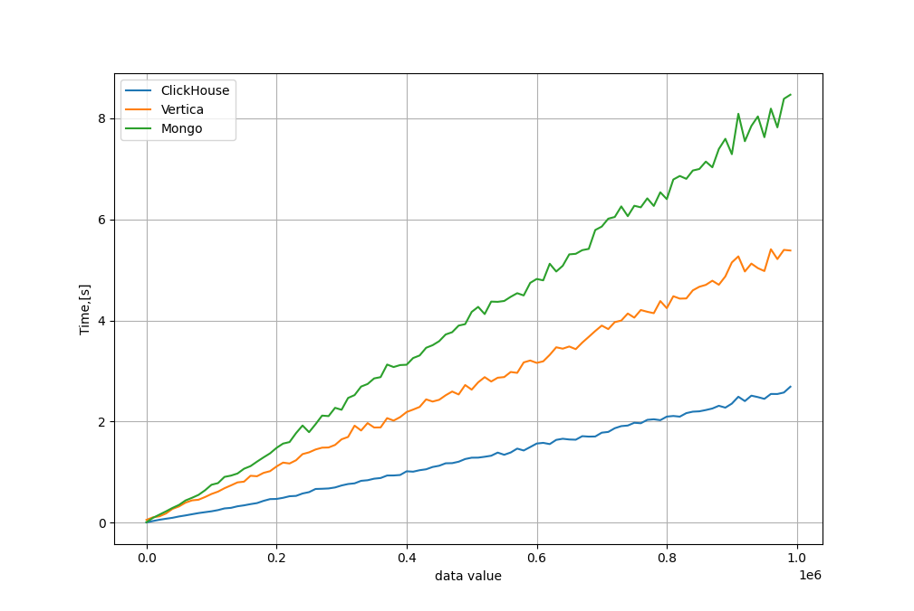
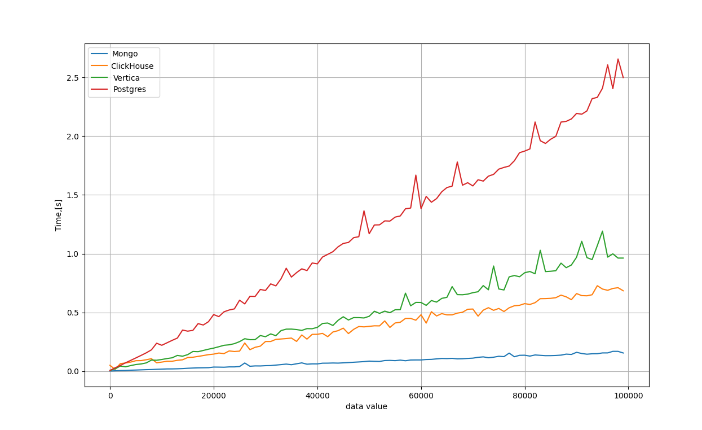

# Результат сравнения производительности БД Vertica и ClickHouse

Для сборки кластеров следует использовать Makefile

Запись в бд:

Чтение из бд:

- ключевым моментом при выборе БД дял пользовательского контента является скорость чтения. В наших тестах mongoDb показал самую высокую скорость в этом тетсе. При этом с увеличением объёма данных скорость чтения для mongoDb падает медленнее чем у других бд из нашего теста. Поэтому в качесте бд для пользовательского контента будет использован mongoDb

