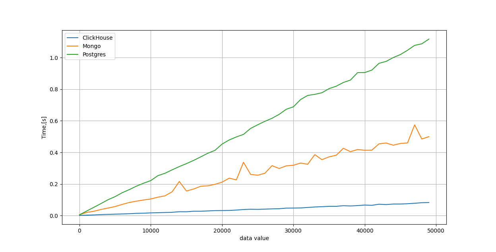

#Результат сравнения производительности БД Vertica и ClickHouse

Запись в бд:

Чтение из бд:

- ClickHouse поддерживает большее количество типов данных в том числе вложенные сложные типы такие как MAP что даёт дополнительную гибкости при использование. В приложение к решаемой задаче это позволило нам реализовать универсальный etl процесс не привязанный получаемой из шины kafka структуре данных.

- ClickHouse обладает развитым комьюнити и техподдержкой (в том числе русскоязычной) а также хорошо проработанной документацией что облегчает его использование в развивающемся проекте. 

- ClickHouse легко масштабируется в случае роста проекта

Опираясь на результаты измерения производительности и озвученные факты в качестве основной бд для хранения аналитических данных был выбран ClickHouse 

